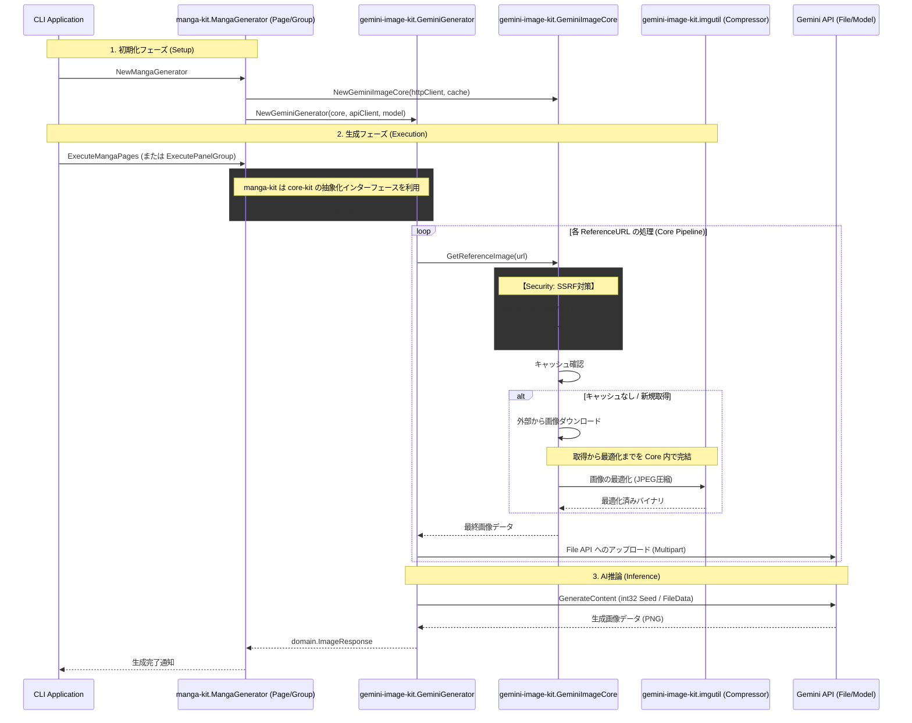

# 🎨 Go Manga Kit

[](https://golang.org/)
[](https://golang.org/)
[](https://github.com/shouni/go-manga-kit/tags)
[](https://opensource.org/licenses/MIT)

## 🚀 概要 (About) - 自動ページ分割対応・漫画制作Workflows

**Go Manga Kit** は、非構造化ドキュメントを解析し、AIによる**キャラクターDNAの一貫性を維持した作画**を行うためのエンジニア向けライブラリです。

[Gemini Image Kit](https://github.com/shouni/gemini-image-kit) を描画コアに採用。独自の**オート・チャンク・システム**により、1ページあたり最大6パネルで自動分割を行います。複数枚の作画として出力できるハイエンドなツールキットです。

---

## ✨ コア・コンセプト (Core Concepts)

* **🧬 Character DNA System**: `domain.Character` に定義したSeed値と視覚特徴をプロンプトへ動的に注入します。全ページを通じてキャラクターの外見を一貫させることが可能です。
* **📑 Auto-Chunk Pagination**: パネル数が上限を超えると自動でページをスライスします。AIの描画限界を回避し、複数枚構成の漫画を安定して生成します。
* **📖 Script-to-Manga Generator**: Markdown等のソースを `parser` が解析し、演出指示を含む構造化データへ変換します。これを `generator` が受け取り、一括で作画を行う一気通貫の設計です。
* **📐 Dynamic Layout Director**: ページごとに「主役パネル（Big Panel）」を動的に決定します。単調なコマ割りを防ぎ、ドラマチックな演出を自動生成します。
* **🛡️ Resilience & Rate Control**: **30s/req (2 RPM)** の厳格なレートリミット制御と、参照画像のTTL付きキャッシュにより、APIクォータを尊重しつつ安定した作画を継続します。

---

## 🏗 システムスタック (System Stack)

| レイヤー | 技術 / ライブラリ | 役割 |
| --- | --- | --- |
| **Intelligence** | **Gemini 3.0 Flash** | 伝説の編集者プロンプトによるネーム構成 |
| **Artistic** | **Nano Banana** | DNA注入と空間構成プロンプトによる一括作画 |
| **Resilience** | **go-cache** | 参照画像のTTL管理（30分）による高速化 |
| **Concurrency** | `x/time/rate` | 安定したAPIクォータ遵守 |
| **Drawing Engine** | `shouni/gemini-image-kit` | Image-to-Image / Multi-Reference 描画コア |
| **I/O Factory** | `shouni/go-remote-io` | GCS/Localの透過的なアクセス |
| **Web Extract** | `shouni/go-web-exact` | Webページからのセマンティックなコンテンツ抽出。 |

---

## 🎨 5つのワークフロー (Workflows)

以下は `pkg/workflow` インターフェースによって定義される、漫画制作の主要な工程です。

| ワークフロー | 担当インターフェース | 内容 |
| --- | --- | --- |
| **1. Scripting** | `ScriptRunner` | Web/テキストから、キャラクター・セリフ・構図を含むJSON台本を生成。 |
| **2. Designing** | `DesignRunner` | キャラクターのDNA（特徴）を固定し、一貫性のあるデザインシートを生成。 |
| **3. Panel Gen** | `PanelImageRunner` | 台本の各パネル（コマ）に対応する画像を、並列かつレート制限を遵守しながら個別に生成。 |
| **4. Page Gen** | `PageImageRunner` | 生成済みのパネル画像を、Markdown形式の台本に基づきページ単位にレイアウトし、最終的なページ画像を生成。 |
| **5. Publishing** | `PublishRunner` | 画像とテキストを統合し、最終的なHTML/Markdown/PNG等で出力。 |

---

## 📦 パッケージ構成 (Package Layout)

| パッケージ | 役割 |
| --- | --- |
| **`pkg/domain`** | `Character`, `Panel`, `Manga` 等の基底モデル。DNA情報やコアとなるデータ構造を定義。 |
| **`pkg/generator`** | **中核機能**。`PageGenerator` や `GroupGenerator` による作画・レイアウト制御を担当。 |
| **`pkg/parser`** | Markdown や正規表現を用いて、ソーステキストをネーム（台本）へ解析・変換。 |
| **`pkg/prompts`** | 描画AIへの空間構成指示や、テンプレート管理を行うプロンプトの司令塔。 |
| **`pkg/publisher`** | 生成したアセットを統合画像（PNG）やHTMLとして書き出す最終出力を担当。 |
| **`pkg/runner`** | `workflow` インターフェースを満たす具体的な実行実体（各工程のメインロジック）。 |
| **`pkg/workflow`** | 全体のワークフロー定義、インターフェース、および `Builder` による統合。 |

---

## 📂 プロジェクト構造 (Project Structure)

```text
go-manga-kit/
└── pkg/             # 公開ライブラリパッケージ
    ├── config/      # 環境変数管理
    ├── domain/      # ドメインモデル (character.go, manga.go)
    ├── generator/   # 生成戦略 (builder.go, page/group_generator.go)
    ├── parser/      # 構文解析 (markdown.go, regex.go)
    ├── prompts/     # プロンプト構築
    ├── publisher/   # 成果物出力 (publisher.go)
    ├── runner/      # ワークフローの実行処理
    └── workflow/    # ワークフローの管理
```

---

## 🏗️ 作画生成シーケンスフロー (Image Generation Sequence Flow)



---

## 🤝 依存関係 (Dependencies)

* [shouni/gemini-image-kit](https://github.com/shouni/gemini-image-kit) - Gemini 画像作成抽象化
* [shouni/go-remote-io](https://github.com/shouni/go-remote-io) - GCS、およびローカルファイルシステムへの I/O 操作を統一化

### 📜 ライセンス (License)

このプロジェクトは [MIT License](https://opensource.org/licenses/MIT) の下で公開されています。
