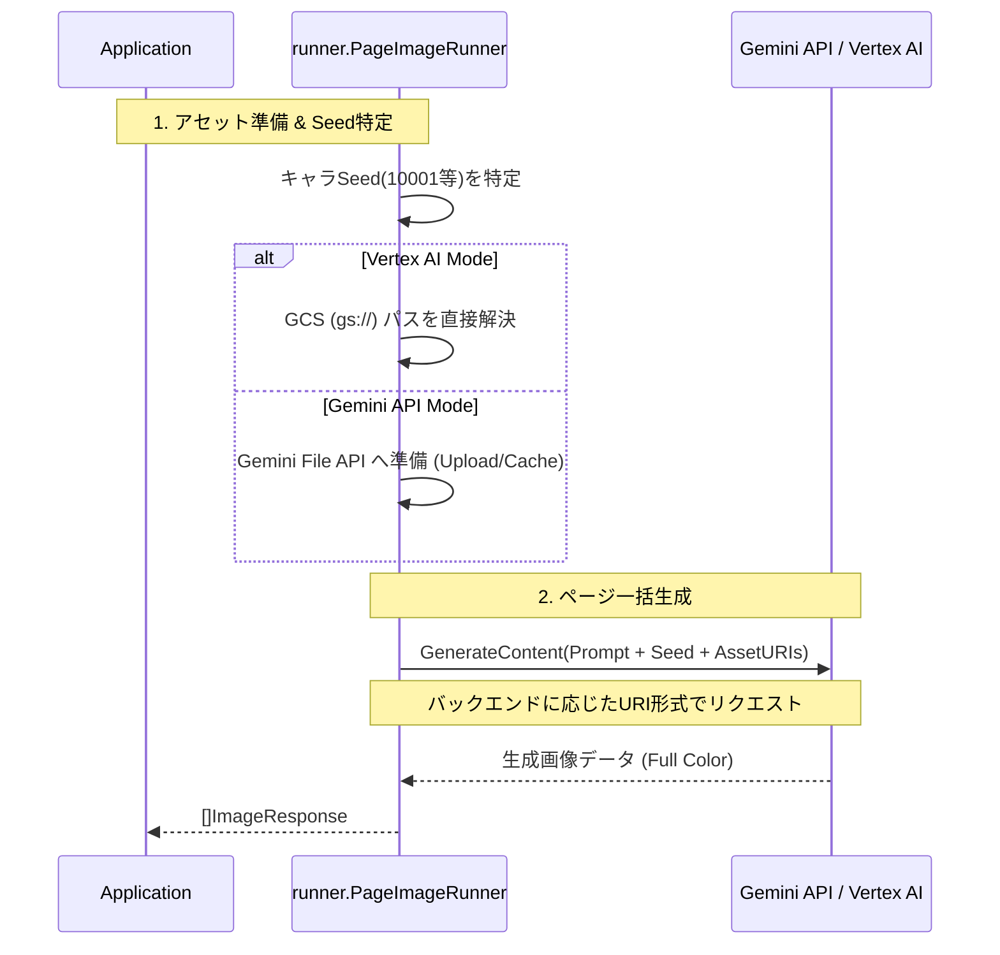

# 🎨 Go Manga Kit

[](https://golang.org/)
[](https://golang.org/)
[](https://github.com/shouni/go-manga-kit/tags)
[](https://opensource.org/licenses/MIT)

## 🚀 概要 (About) - キャラクターDNA維持・フルカラー作画Workflowライブラリ

**Go Manga Kit** は、非構造化ドキュメントを解析し、AIによる**キャラクターDNAの一貫性を維持したフルカラー作画**を行うためのエンジニア向けライブラリです。

[Gemini Image Kit](https://github.com/shouni/gemini-image-kit) を描画コアに採用。独自の**Seedシンクロナイズ機能**と**Dynamic Asset Mapping**により、複数ページにわたる作品でもキャラクターの造形と色彩を高い精度で固定することが可能です。

---

## ✨ コア・コンセプト (Core Concepts)

* **🧬 3-Factor Consistency Control**:
    * キャラクターの一貫性を担保するため、**Seed値**（基盤）、**参照アセット**（外見）、**VisualCues/言語指示**（詳細）の3要素を組み合わせて制御します。
* **Multi-Backend Asset Support**: 
    * Gemini API モードでは **File API**、Vertex AI モードでは **Cloud Storage (GCS)** 上の画像を直接参照可能です。
* **📐 Strict Layout & Count Control**: 
    * 「指定されたコマ数を厳密に守る」ためのプロンプト・ガードレールを搭載。`FINAL PANEL` 指示等により、AIによる勝手なコマ追加を抑制します。
* **🎨 Vibrant Color Guidance**:
    * モノクロ化を抑制。参照画像が白黒やラフスケッチであっても、プロンプト技術により鮮やかなデジタルアニメ調の彩色を強く誘導します。
* **⚡ Smart Asset Management**: 
    * Vertex AI 利用時は `gs://` パスをそのまま使用することで、アップロードのオーバーヘッドをゼロにします。
    * Gemini API 利用時は、同一URLの二重アップロードを防止するキャッシュ機構が自動で作動します。
    * `singleflight` により同一URLの二重アップロードを防止。Gemini File API クォータを節約しながら、並列アセット準備を実現します。

---

## 🎨 5つのワークフロー (Workflows)

| ワークフロー | 担当インターフェース | 内容 |
| --- | --- | --- |
| **1. Designing** | `DesignRunner` | キャラのDNA（Seed/特徴）を固定し、デザインシートを生成。 |
| **2. Scripting** | `ScriptRunner` | 原稿から、キャラ・セリフ・構図を含むJSON台本を生成。 |
| **3. Panel Gen** | `PanelImageRunner` |各パネルを、キャラ固有Seedを用いて個別に高精度生成。 |
| **4. Publishing** | `PublishRunner` | 画像とテキストを統合し、HTML/Markdown等で出力。 |
| **5. Page Gen** | `PageImageRunner` | 台本に基づき、ページ単位で再レイアウト・一括作画。 |

---

## 📂 プロジェクト構造 (Project Structure)

本ライブラリは、不変のデータモデルを中心に、生成戦略を柔軟に入れ替え可能な**ストラテジー・パターン**に基づいて構成されています。

```text
go-manga-kit/
└── pkg/
    ├── domain/      # 【不変の核】キャラクターDNA(Seed/VisualCues)やManga/Panelの基底定義。
    ├── workflow/    # 【契約・統合】各工程のインターフェース定義と、一連の工程を管理するManager。
    ├── runner/      # 【実行実体】Design/Script/Panel/Page/Publish の具体的な実行プロセス。
    ├── generator/   # 【生成戦略】Page/Panel構成、Composerによるレイアウト計算アルゴリズム。
    ├── prompts/     # 【言語戦略】テンプレート（.md）とデータを用いたAI指示文の動的構築。
    ├── parser/      # 【解析】入力テキストやAIレスポンスを構造化データへ変換。
    ├── publisher/   # 【出力】生成された画像とテキストを最終成果物として統合。
    ├── asset/       # 【アセット管理】アセットのパス解決およびURIマッピング。
    └── config/      # 【設定】ライブラリ全体の動作パラメータ管理。

```

---

## 🏗️ 作画生成シーケンスフロー (Image Generation Sequence)



---

### 🤝 依存関係 (Dependencies)

* [shouni/gemini-image-kit](https://github.com/shouni/gemini-image-kit) - Gemini 画像作成コア
* [shouni/go-remote-io](https://github.com/shouni/go-remote-io) - マルチストレージ I/O

### 📜 ライセンス (License)

このプロジェクトは [MIT License](https://opensource.org/licenses/MIT) の下で公開されています。
