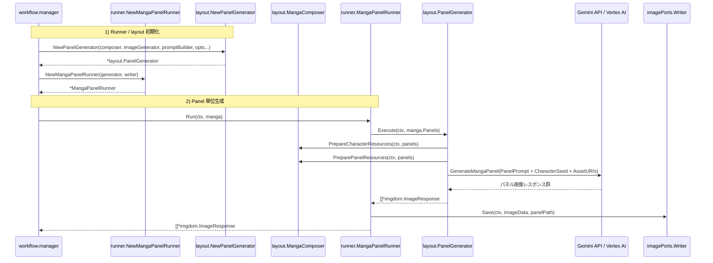
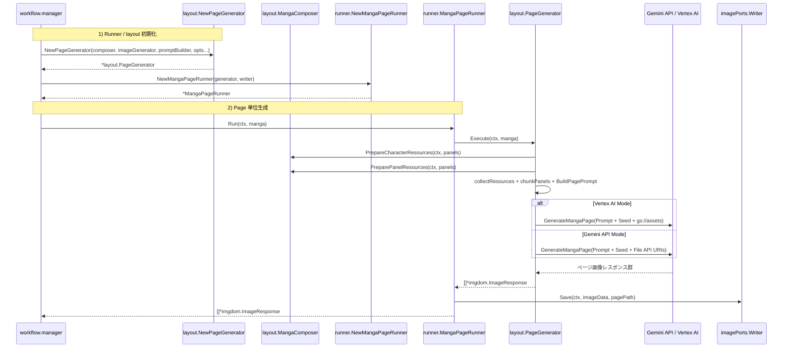

# 🎨 Go Manga Kit

[](https://golang.org/)
[](https://golang.org/)
[](https://github.com/shouni/go-manga-kit/tags)
[](https://opensource.org/licenses/MIT)

## 🚀 概要 (About) - キャラクターDNA維持・画像生成Workflow

**Go Manga Kit** は、非構造化ドキュメントを解析し、AIによる**キャラクターDNAの一貫性を維持した画像生成**を行うためのツールキットです。

[Gemini Image Kit](https://github.com/shouni/gemini-image-kit) を描画コアに採用。独自の**Seedシンクロナイズ機能**と**Dynamic Asset Mapping**により、複数ページにわたる作品でもキャラクターを固定することが可能です。

また、**並列実行制御（Semaphore）** と **APIレート制限** により、Vertex AI などのクォータ制限下でも、安定した大規模生成パイプラインの構築を実現します。

---

## ✨ コア・コンセプト (Core Concepts)

* **🧬 3-Factor Consistency Control**:
    * キャラクターの一貫性を担保するため、**Seed値**（基盤）、**参照アセット**（外見）、**VisualCues/言語指示**（詳細）の3要素を組み合わせて制御します。
* **🌍 Multi-Backend Asset Support**: 
    * Gemini API モードでは **File API**、Vertex AI モードでは **Cloud Storage (GCS)** 上の画像を直接参照可能です。
* **🛡 Production-Ready Concurrency Control**:
    * セマフォ（Semaphore）を用いた細やかな並列実行制御を内包。API の `RESOURCE_EXHAUSTED` (429) エラーを未然に防ぎ、スロットルを効かせた堅牢なバッチ処理を可能にします。
* **⚡  Smart Asset Management**: 
    * Vertex AI 利用時は `gs://` パスをそのまま使用することで、アップロードのオーバーヘッドを軽減します。
    * Gemini API 利用時は `singleflight` により同一URLの二重アップロードを防止。Gemini File API クォータを節約しながら、並列アセット準備を実現します。

---

## 🎨 5つのワークフロー (Workflows)

| ワークフロー | 担当インターフェース | 内容 |
| --- | --- | --- |
| **1. Designing** | `DesignRunner` | キャラのDNA（Seed/特徴）を固定し、デザインシートを生成。 |
| **2. Scripting** | `ScriptRunner` | 原稿から、キャラ・セリフ・構図を含むJSON台本を生成。 |
| **3. Panel Gen** | `PanelImageRunner` |各パネルを、キャラ固有Seedを用いて個別に高精度生成。 |
| **4. Page Gen**   | `PageImageRunner` | 台本に基づき、ページ単位で再レイアウト・一括作画。 |
| **5. Publishing** | `PublishRunner` | 画像とテキストを統合し、HTML/Markdown等で出力。 |

---

## 📂 プロジェクト構造 (Project Structure)

本ライブラリは、**ports による抽象化**を境界とし、生成の各工程を独立した戦略として入れ替え可能な設計に基づいています。

```text
go-manga-kit/
├── workflow/    # 【統合管理】各工程を組み合わせ、Workflows インターフェースを実装。
├── runner/      # 【実行実体】Design/Script/Panel/Page/Publish の具体的なプロセス実装。
├── layout/      # 【生成戦略】Page/Panel構成、Composerによるレイアウト計算。
├── parser/      # 【解析】入力テキストやAIレスポンスを構造化データへ変換。
├── ports/       # 【契約・定義】Interface、共通モデル、動作設定(Config)。※全ての起点。
├── publisher/   # 【出力】生成された画像とテキストを最終成果物として統合。
└── asset/       # 【アセット管理】アセットのパス解決およびURIマッピング。

```

---

## 🔄 シーケンスフロー (Sequence Flow)

### Panel Image Flow (`NewMangaPanelRunner`)


```mermaid
sequenceDiagram
  participant WF as workflow.manager
  participant PrFactory as runner.NewMangaPanelRunner
  participant LPanel as layout.NewPanelGenerator
  participant Composer as layout.MangaComposer
  participant PanelRunner as runner.MangaPanelRunner
  participant PanelGen as layout.PanelGenerator
  participant API as Gemini API / Vertex AI
  participant Writer as imagePorts.Writer

  Note over WF,LPanel: 1) Runner / layout 初期化
  WF->>LPanel: NewPanelGenerator(composer, imageGenerator, promptBuilder, opts...)
  LPanel-->>WF: *layout.PanelGenerator
  WF->>PrFactory: NewMangaPanelRunner(generator, writer)
  PrFactory-->>WF: *MangaPanelRunner

  Note over WF,PanelRunner: 2) Panel 単位生成
  WF->>PanelRunner: Run(ctx, manga)
  PanelRunner->>PanelGen: Execute(ctx, manga.Panels)
  PanelGen->>Composer: PrepareCharacterResources(ctx, panels)
  PanelGen->>Composer: PreparePanelResources(ctx, panels)
  PanelGen->>API: GenerateMangaPanel(PanelPrompt + CharacterSeed + AssetURIs)
  API-->>PanelGen: パネル画像レスポンス群
  PanelGen-->>PanelRunner: []*imgdom.ImageResponse
  PanelRunner->>Writer: Save(ctx, imageData, panelPath)
  PanelRunner-->>WF: []*imgdom.ImageResponse

```

### Page Image Flow (`NewMangaPageRunner`)


```mermaid
sequenceDiagram
  participant WF as workflow.manager
  participant LPage as layout.NewPageGenerator
  participant Composer as layout.MangaComposer
  participant PFactory as runner.NewMangaPageRunner
  participant PageRunner as runner.MangaPageRunner
  participant PageGen as layout.PageGenerator
  participant API as Gemini API / Vertex AI
  participant Writer as imagePorts.Writer

  Note over WF,LPage: 1) Runner / layout 初期化
  WF->>LPage: NewPageGenerator(composer, imageGenerator, promptBuilder, opts...)
  LPage-->>WF: *layout.PageGenerator
  WF->>PFactory: NewMangaPageRunner(generator, writer)
  PFactory-->>WF: *MangaPageRunner

  Note over WF,PageRunner: 2) Page 単位生成
  WF->>PageRunner: Run(ctx, manga)
  PageRunner->>PageGen: Execute(ctx, manga)
  PageGen->>Composer: PrepareCharacterResources(ctx, panels)
  PageGen->>Composer: PreparePanelResources(ctx, panels)
  PageGen->>PageGen: collectResources + chunkPanels + BuildPagePrompt

  alt Vertex AI Mode
    PageGen->>API: GenerateMangaPage(Prompt + Seed + gs://assets)
  else Gemini API Mode
    PageGen->>API: GenerateMangaPage(Prompt + Seed + File API URIs)
  end

  API-->>PageGen: ページ画像レスポンス群
  PageGen-->>PageRunner: []*imgdom.ImageResponse
  PageRunner->>Writer: Save(ctx, imageData, pagePath)
  PageRunner-->>WF: []*imgdom.ImageResponse

```

---

### 🤝 依存関係 (Dependencies)

* [shouni/gemini-image-kit](https://github.com/shouni/gemini-image-kit) - Gemini画像生成コア

### 📜 ライセンス (License)

このプロジェクトは [MIT License](https://opensource.org/licenses/MIT) の下で公開されています。
